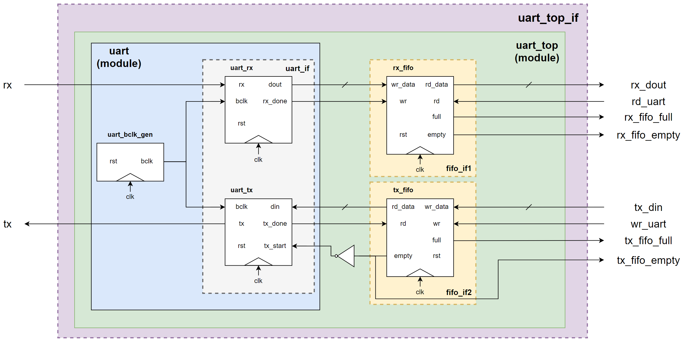
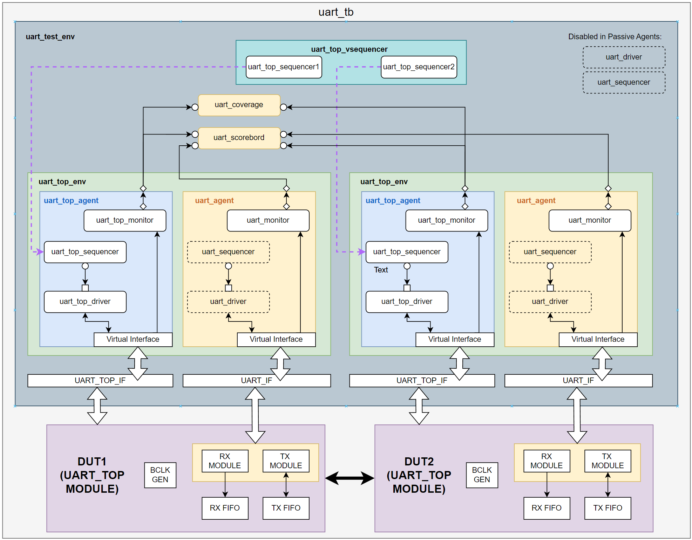
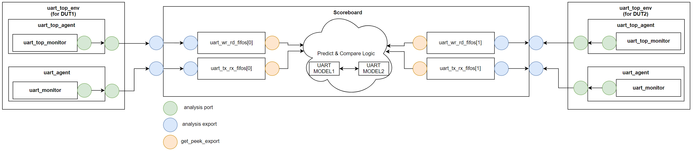

# UART with FIFO

# Introduction

The synchronous FIFO used in this design is previously verified in the [fifo_uvm](https://github.com/sapphirep/fifo_uvm) project

The UVM testbench for testing UART only (without FIFOs) can be found under the “uart_uvm” branch. UART loopback mode was verified here.

The main branch of the repository contains the RTL design for UART with RX and TX FIFOs along with a UVM testbench for verifying full-duplex and half-duplex modes.

💫 = Key project highlights =💫 

- UVM
- Multi-agent environment (passive & active)
- Virtual sequencer + virtual sequences
- TLM analysis port and analysis FIFO for IPC (interprocess communication)
- Functional coverage

# UART with FIFO RTL Design



## Basic Operation

- When `wr_uart` is asserted:
    1. Data on `tx_din` gets written to the TX FIFO if it is not full. The FIFO is FWFT (first-word fall- through), meaning data is immediately available on `rd_data` after first write.
    2. UART TX starts whenever FIFO becomes non-empty.
    3. UART TX done triggers read on the TX FIFO, removing the just transmitted data from FIFO.
- When `rd_uart` is asserted:
    - Data is read out from the RX FIFO. If `rd_uart` occurs on an empty RX FIFO, `rx_dout`  is invalid.
    - Behind the scenes:
        - `rx_done` from the UART RX module triggers the received data to be written into the RX FIFO.
        - If RX FIFO is already full, new received data will not be written into the FIFO.

## Modules and Interfaces

- `uart_top` module
    - uses `uart_top_if` (interface)
    - top level module containing:
        - `uart` module
        - TX FIFO module
        - RX FIFO module
- `uart` module
    - uses `uart_if` (interface)
    - top level module for RX and TX functionalities, it contains:
        - `uart_tx` - transmitter module
        - `uart_rx` - receiver module
        - `uart_bclk_gen` -baud clock generator module
- TX and RX fifo are instances of `uart_fifo` module, which uses `fifo_if`

# UVM Testbench Architecture



## test_top_env

Each`test_top_env` contains a `uart_top_agent` and a `uart_agent`  for interacting with the DUT.

The `uart_agent` is re-used from the single UART loop-back self test. It is configured as a passive agent. It monitors `tx_done` and `rx_done` signals from the `uart_if` .

The `uart_top_agent` is an active agent. It interacts with the DUT via `uart_top_if`. Its driver actively drives the DUT upon read/write sequences. The monitor monitors `rd_uart` and `wr_uart` commands.

These two agents could have been merged together for a simpler testbench architecture. However, doing so will result in adding additional signals like `tx_done` and `rx_done` that are needed by the `uart_top_if`. I would like to keep the agent functions modular and re-use the existing `uart_agent` instead.

In summary:

- `uart_top_agent` (active)
    - responsible for driving and monitoring `rd_uart` and `wr_uart` commands
    - interacts with `uart_top_if`
- `uart_agent` (passive)
    - responsible for monitoring `rx_done` and `tx_done`
    - interacts with `uart_if`

## uart_test_env

The `uart_test_env` consists of:

- 2 `test_top_env`  - one for each DUT
- scoreboard
- coverage checker
- virtual sequencer

# Sequences

## Base Sequence Class

The base sequence class contains a `randc` integer to decide the number of times an operation (`rd_uart/wr_uart`) will be performed.

The `uart_write_seq` and `uart_read_seq` extends this base class.

```verilog
class uart_seq_base extends uvm_sequence #(uart_transaction);
    `uvm_object_utils(uart_seq_base)

    uart_transaction tr;
    randc int iterations;

    constraint loop {
        iterations inside {[0:20]};
    }

    function new (string name = "uart_sequence");
        super.new(name);
    endfunction
    
endclass: uart_seq_base
```

## UART Write & Read Sequences

The write sequence executes `wr_uart` commands back-to-back in a loop.

```verilog
class uart_write_seq extends uart_seq_base;
    `uvm_object_utils(uart_write_seq)
		...

    task body();
        repeat(ierations)
        begin
            tr = uart_transaction::type_id::create("tr");
            if(!(tr.randomize())) `RANDOMIZE_FAIL
            tr.wr_uart = 1'b1;
            start_item(tr);
            finish_item(tr);
        end
    endtask

endclass: uart_write_seq
```

The read sequence executes `rd_uart` commands back-to-back in a loop.

```verilog
class uart_read_seq extends uart_seq_base;
    `uvm_object_utils(uart_read_seq)
		...

    task body();
        repeat(ierations)
        begin
            tr = uart_transaction::type_id::create("tr");
            if(!(tr.randomize())) `RANDOMIZE_FAIL
            tr.rd_uart = 1'b1;
            start_item(tr);
            finish_item(tr);
        end
    endtask

endclass: uart_read_seq
```

# Virtual Sequences and Virtual Sequencer

Since there are multiple drivers in the test environment, a virtual sequence is needed to coordinate the stimulus generation between the drivers. 

## Virtual Sequencer

Like any sequence, a virtual sequence needs to run on a virtual sequencer. 

The virtual sequencer acts like a container object for sub-sequencers.

```verilog
class uart_top_vsequencer extends uvm_sequencer;
    `uvm_component_utils(uart_top_vsequencer)

	// Sub-sequencers
    uart_top_sequencer agt1_sqr;
    uart_top_sequencer agt2_sqr;

    function new (string name, uvm_component parent);
        super.new(name, parent);
    endfunction
    
endclass: uart_top_vsequencer
```

The virtual sequencer is created during `uart_test_env`'s `build_phase`. Its handle is stored inside the `uvm_resource_db` so virtual sequence can access it later.

The environment then connects the `uart_top_sequencer` in each `uart_top_agent` to its respective sub-sequencer handle inside the virtual sequencer. This is done inside `connect_phase`, after all testbench components have been built.

```verilog
class uart_test_env extends uvm_env;
	`uvm_component_utils(uart_test_env)
	
	...
	uart_top_env        top_env1, top_env2;
  uart_top_vsequencer vsqr;
	...
	
	function void uart_test_env::build_phase (uvm_phase phase);
	    ...
	    top_env1 = uart_top_env::type_id::create("top_env1", this);
	    top_env2 = uart_top_env::type_id::create("top_env2", this);
	    ...
	    vsqr     = uart_top_vsequencer::type_id::create("vsqr", this);
	
	    // Store virtual sequencer handle into uvm_resource_db
	    uvm_resource_db #(uart_top_vsequencer)::set("vsqr::*", "vsqr", vsqr, this);
	
	endfunction: build_phase

	function void uart_test_env::connect_phase (uvm_phase phase);
	
	    super.connect_phase(phase);
			...
			
	    // Connect virtual sequencer sub-sequencers
	    vsqr.agt1_sqr = top_env1.uart_top_agt.sqr;
	    vsqr.agt2_sqr = top_env2.uart_top_agt.sqr;
	    
			...
	
	endfunction: connect_phase
	
	...
endclass: uart_test_env
```

## Virtual Sequence Base Class

A virtual sequence base class is used to extract sub-sequencers from the virtual sequencer.

Instead of using the ``uvm_declare_p_sequencer` macro to get the virtual sequencer handle from casting the `m_sequencer`, `uvm_resource_db` is used to retrieve the virtual sequencer handle inside the base virtual sequence base class.

Sub-sequencer handles are extracted from the virtual sequencer.

```verilog
class uart_top_vseq_base extends uvm_sequence #(uvm_sequence_item);
    `uvm_object_utils(uart_top_vseq_base)

    uart_top_vsequencer vsqr;
    uart_top_sequencer  agt1_sqr;
    uart_top_sequencer  agt2_sqr;

    function new (string name = "uart_top_vseq_base");
        super.new(name);
    endfunction

    virtual task body();
        if (!uvm_resource_db #(uart_top_vsequencer)::read_by_name("vsqr::*", "vsqr", vsqr, this))
            `uvm_fatal("VSEQ BASE", "Failed to retrieve virtual sequencer handle!")

        agt1_sqr = vsqr.agt1_sqr;
        agt2_sqr = vsqr.agt2_sqr;
    endtask

endclass: uart_top_vseq_base
```

## Half Duplex Virtual Sequence

To test half-duplex mode, the half-duplex virtual sequence alternates read and write sequence between the UARTs.

A delay is used to wait for TX for finish before the receiver UART reads.

## Full Duplex Virtual Sequence

To test full-duplex mode, the full-duplex virtual sequence starts write sequence on both UARTs simultaneously using parallel threads.

A delay is used to wait for TX for finish before the UARTs read.

The UARTs then read simultaneously by executing read sequences in parallel.

# Monitors

Each `uart_top_env` consists of 2 monitors:

- `uart_top_monitor` - for monitoring `rd_uart` and `wr_uart` commands
- `uart_monitor` - for monitoring `tx_done` and `rx_done` statuses

Each monitor has a TLM Analysis port connected to its agent’s Analysis port.

# Scoreboard with TLM Analysis FIFOs

The scoreboard has a total of 4 TLM Analysis FIFOs:

- `uart_wr_rd_fifos[2]` - used for receiving `rd_uart` and `wr_uart` commands from each DUT’s `uart_top_monitor`
- `uart_tx_rx_fifos[2]` - used for receiving `tx_done`and `rx_done`from each DUT’s `uart_monitor`

The analysis export of each TLM Analysis FIFO connects to a TLM Analysis Export:

- `uart_top_axps[2]` - connected to `uart_wr_rd_fifos[2]`
- `uart_axp[2]` - connected to `uart_tx_rx_fifos[2]`

Each TLM Analysis FIFO also has a `get_peek_export` which allows transactions to be extracted using a blocking `get` method.

The TLM port connection diagram is shown below:



The scoreboard spawns 4 parallel running threads to process each TLM Analysis FIFO in its `run_phase`. Internally, it uses two UART behavioral models connected to each other to predict output and compare results from DUTs.

Detailed explanation of scoreboard logic can be found inside source code.

# Coverage Collector

Similar to the scoreboard, the coverage collector contains TLM Analysis FIFOs and Exports for subscribing to monitor broadcasting events.

However, it only listens to `uart_top_monitor` because coverage on `uart_monitor` is not needed.

Coverage is collected on the RX and TX FIFO statuses of both DUTs to ensure exercise of edge cases:

1. Keep writing until TX FIFO is full
2. Keep transmitting until RX FIFO is full
3. Keep reading until RX FIFO is empty

100% functional coverage is achieved using the half-duplex sequence.